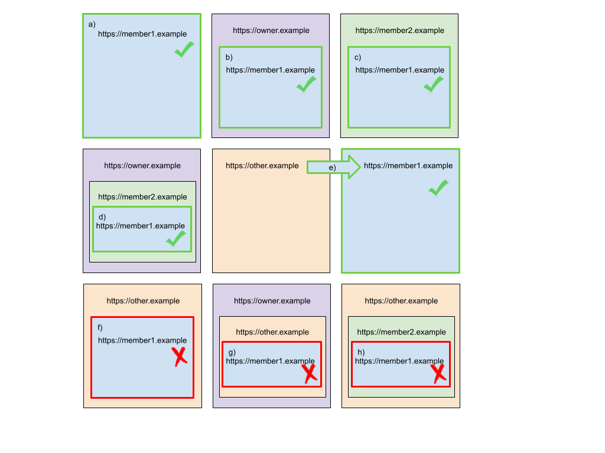

# SameParty cookie attribute explainer

## Authors
 * chlily@chromium.org
 * kaustubhag@chromium.org
 * davidben@chromium.org
 * cfredric@chromium.org

## Motivation

In order to increase privacy on the web, browser vendors are planning restrictions on cross-site tracking, such as [phasing out third-party cookies](https://blog.chromium.org/2020/01/building-more-private-web-path-towards.html). Third-party cookies are currently [defined](https://developer.mozilla.org/en-US/docs/Web/HTTP/Cookies#Tracking_and_privacy) as those associated with a [site](https://html.spec.whatwg.org/multipage/origin.html#sites) that is different from the site of the top-level page. However, modern websites are typically served over multiple domains/sites, many of which are owned by the same organization. For example, websites that host user-uploaded content often choose to host it on a different domain for enhanced security. [First-Party Sets](https://github.com/privacycg/first-party-sets) provides a mechanism to group domains/sites belonging to the same organization as being _same-party_ with each other, and thus defines a _privacy boundary_ for websites.

The `SameParty` cookie attribute provides web developers a means to annotate cookies that are allowed to be set or sent in same-party, cross-site contexts; and hence should not be subject to obsoletion. In addition, `SameParty` cookies are blocked in cross-party, cross-site contexts.

Introducing `SameParty` now, early in the process of phasing out third-party cookies, provides a means for sites to test out the First-Party Set behavior. While third-party cookies are still around today, we want to provide ample opportunities for web developers to test that their sites work with `SameParty` and to migrate their cookies to the new model far in advance of third-party cookies' obsoletion.


### Why support SameSite=Lax and SameSite=None in conjunction with SameParty?

Allowing for both `SameSite=Lax` and `SameSite=None` lets developers decide the fallback behavior of a cookie if `SameParty` is not supported by a user’s browser. This helps smooth out the transition period before `SameParty` is widely supported.

A developer who is more interested in protecting a particular cookie’s content than having it sent may opt for `SameSite=Lax; SameParty` which will fallback to `SameSite=Lax` and protect the cookie from being sent from other sites.

On the other hand, a developer who is more interested in preserving the behavior of their site(s) which need a particular cookie may opt for `SameSite=None; SameParty` which will fallback to `SameSite=None` and allow for the cookie to continue to be sent.


### Why is SameSite=Strict not supported?

First-Party Sets is intended to define a privacy boundary for websites, while continuing to treat [site](https://html.spec.whatwg.org/multipage/origin.html#sites) (and [progressively](https://github.com/mikewest/scheming-cookies), the origin) as the security boundary for cookies. `SameSite=Strict` provides CSRF protections in cross-site contexts that should not be loosened even when the sites in question are same-party.


### Why introduce a new SameParty attribute? Why not treat SameSite=None as cross-site same-party cookies?

`SameSite=None` cookies without the `SameParty` attribute will be treated as cross-site cross-party cookies, which are on the path to obsoletion. In the long-term, browsers may choose to deprecate the `SameSite=None` attribute specification.


## Setting SameParty cookies: Set-Cookie header syntax

The `SameParty` cookie attribute can be applied to a cookie by appending it to the semicolon-delimited list of attributes in a `Set-Cookie` header, such as:


```
Set-Cookie: cookie=tasty; SameSite=Lax; Secure; SameParty
```


The `SameParty` attribute is specified without a value (as are `Secure` and `HttpOnly`). The `Secure` attribute is required in order to use the `SameParty` attribute. **Any cookie specifying `SameParty` without `Secure` will be rejected as invalid. Additionally, any cookie specifying `SameParty` in the presence of `SameSite=Strict` will be rejected as invalid.**

A browser that does not yet support the `SameParty` attribute [should](https://tools.ietf.org/html/draft-ietf-httpbis-rfc6265bis-05#section-4.1.2) ignore the `SameParty` cookie attribute, but should not reject the cookie. However, Chrome installations where First-Party Sets are supported but have been disabled **will still reject** invalid `SameParty` cookies.


## SameParty and SameSite

A cookie with `SameParty` may have `SameSite=None` or `SameSite=Lax`, or not specify a valid `SameSite` attribute. For such a cookie, **any cookie access rules associated with the `SameSite` attribute will be ignored, and the `SameParty` rules (described below) will be enforced instead**.

Table cells below give the effective enforcement mode for a cookie with a combination of the specified `SameSite` and/or `SameParty` attributes:


<table>
  <tr>
   <td>
   </td>
   <td><strong><code>SameSite=None</code></strong>
   </td>
   <td><strong><code>SameSite=Lax</code></strong>
   </td>
   <td><strong><code>SameSite=Strict</code></strong>
   </td>
   <td><strong>Unspecified <code>SameSite</code> (<a href="https://www.chromestatus.com/feature/5088147346030592">treated as Lax</a>)</strong>
   </td>
  </tr>
  <tr>
   <td><strong>Has <code>SameParty</code></strong>
   </td>
   <td><code>SameParty</code>
   </td>
   <td><code>SameParty</code>
   </td>
   <td>Cookie not valid, will be rejected
   </td>
   <td><code>SameParty</code>
   </td>
  </tr>
  <tr>
   <td><strong>No <code>SameParty</code></strong>
   </td>
   <td><code>SameSite=None</code>
   </td>
   <td><code>SameSite=Lax</code>
   </td>
   <td><code>SameSite=Strict</code>
   </td>
   <td><code>SameSite=Lax<sup>1</sup></code>
   </td>
  </tr>
</table>


<sup>1</sup> Cookies specifying neither `SameSite` nor `SameParty` attributes that are defaulted into `SameSite=Lax` mode will also be sent with non-idempotent (e.g. POST) top-level cross-site requests for a certain amount of time after their creation. Support for this temporary intervention (creation-time-based "Lax + POST") will be removed in the future.

A `SameParty` attribute overrides `SameSite=None`, such that browser interventions applying to `SameSite=None` cookies will not apply to cookies with a `SameParty` attribute (even if they also carry `SameSite=None`).


## SameParty cookies on HTTP requests: Cookie header rules

**A `SameParty` cookie is included in an HTTP request if the origins of the requested URL and all of the ancestor frames in the target browsing context belong to the same First-Party Set.** For example, a top-level navigation will always send `SameParty` cookies. Note that requests are treated the same regardless of the HTTP method (GET, POST, etc.), and the origin of the request initiator does not factor into whether the `SameParty` cookie should be allowed.

For example, suppose that owner.example owns a First-Party Set containing {member1.example, member2.example}. Then a `SameParty` cookie set by member1.example **would be sent** to https://member1.example in the following contexts:





1. Main frame request
2. Embedded in owner
3. Embedded in different member of the same set
4. Nested, ancestor frames all belong to same set
5. Top-level navigation from unrelated site, regardless of HTTP method (GET, POST, etc.)

A `SameParty` cookie set by member1.example **would not be sent** to https://member1.example in the following contexts:


6. Embedded in unrelated site
7. Nested on owner site, but ancestor frames include unrelated site
8. Nested on unrelated site, even if immediate parent frame is part of the same set


## SameParty cookies in HTTP responses: Set-Cookie header rules

A `SameParty` cookie in a `Set-Cookie` response header is stored if and only if the corresponding request would have sent `SameParty` cookies in its request headers.

This means that the same rules (described above) apply to the contexts in which `SameParty` cookies may be set.


## Reading SameParty cookies from JavaScript

`SameParty` cookies can be used with JavaScript APIs such as <code>[document.cookie](https://developer.mozilla.org/en-US/docs/Web/API/Document/cookie)</code> and the [CookieStore API](https://wicg.github.io/cookie-store/). A `SameParty` cookie is accessible from JavaScript if the script is running in the context of a frame for which `SameParty` cookies were accessible when the frame was loaded.


## SameParty vs SameSite enforcement modes

Adding `SameParty` to a cookie that would otherwise be subject to the "[Lax](https://tools.ietf.org/html/draft-ietf-httpbis-rfc6265bis-05#section-5.3.7.1)" or "[Lax-allowing-unsafe](https://tools.ietf.org/html/draft-west-cookie-incrementalism-01#section-3.1.1)" enforcement modes of `SameSite` weakens security properties by expanding the set of contexts in which the cookie may be accessed. A site that chooses to use `SameParty` cookies must accept the increased risk from CSRF and other cross-site attacks, and should have a commensurate level of trust in the other members of its First-Party Set. Ideally, [other security measures](https://cheatsheetseries.owasp.org/cheatsheets/Cross-Site_Request_Forgery_Prevention_Cheat_Sheet.html) should be in place, in particular, to protect against malicious cross-site top-level POST requests.

A site may use a `SameParty` attribute without being in a First-Party Set, in which case the same `SameParty` rules apply over a single registrable domain (i.e. the site's eTLD+1) rather than over a set of registrable domains contained in a First-Party Set. (Since, by default, a registrable domain that is not in any specified First-Party Set is treated as first-party with only itself.) Note that the `SameParty` access rules are equivalent to the [Lax-allowing-unsafe](https://tools.ietf.org/html/draft-west-cookie-incrementalism-01#section-3.1.1) enforcement mode of the `SameSite` attribute (a.k.a. "Lax+POST"), if the cookie's domain has a registrable domain not in a First-Party Set.

However, **only for the initial prototype in Chrome, a cookie that specifies `SameParty` while the site is not in a First-Party Set will be subject to `SameSite` enforcement rules, rather than `SameParty` rules**. This is because the First-Party Sets are to be delivered via Component Updater, and there may be a gap between when the First-Party Sets are updated and when the `SameParty` cookies are deployed, during which the cookies should not be subject to Lax-allowing-unsafe enforcement to avoid site breakage.


## For initial prototype only: SameParty and third-party cookie settings in Chrome

`SameParty` cookies are subject to the same user-controlled third-party cookie blocking settings as other cookies, during this initial prototype phase in Chrome. If a user has third-party cookie blocking enabled globally or for a specific site, cookies will not be sent in a cross-site context, regardless of the presence of `SameParty`. This behavior is intended for the initial prototype because we believe it aligns with users’ current expectations with respect to their privacy controls. For the eventual launch, we intend to treat members of the same First-Party Set as being within a first-party context (and thus not subject to third-party cookie blocking within that first-party context). However, we would like to make improvements upon this prototype in preparation for that launch. Specifically: (a) The UI surface to expose First-Party Set membership information to users is not part of this prototype; and (b) We hope to evolve UA Policy on acceptable sets during this period.

